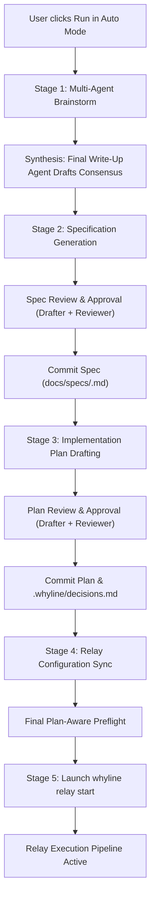

# Research: Visible Backup Agent & Autonomous End-to-End Plan ("Auto Mode")

**Author**: Antigravity  
**Role**: Research & Architecture  
**Scope**: Whyline Console (`agentdock`) & Whyline Relay (`whyline-relay`)  
**Artifact Target**: `.whyline/relay/brainstorm-tmp/antigravity.md`  

---

## 1. Executive Summary

This independent research evaluates two high-impact architectural enhancements for the Whyline system:

1. **Top Context-Bar Backup Agent Selector**:
   - **Problem**: Failover agents are currently invisible in the top context bar. Automatic fallback logic operates silently, preventing users from seeing who acts as backup or persisting a deliberate repo-level or global failover choice.
   - **Solution**: Surface a first-class `Backup` selector directly in the top context bar beside `Agent`, `Model`, and `Repo`. Support explicit agent choices, `(none)`, and `auto (<agent>)` with immediate visual feedback, dirty-state detection, and persistence via the `Save` button (per-repo and optionally global).

2. **Autonomous End-to-End Plan Execution ("Auto Mode")**:
   - **Problem**: Creating and executing a plan currently requires repetitive manual handoffs across multiple modals and approval prompts: Brainstorm → review synthesis → approve → generate spec → approve → generate plan → approve → open Set up modal → configure roles → run preflight checks → start relay. Furthermore, running preflight *after* planning introduces fatal blocker risks (e.g., discovering dirty Git states from decision logs or unauthenticated models after an hour of drafting).
   - **Solution**: Introduce an `Auto mode` source in `RelayPlanScreen`. When selected, the form aggregates Brainstorm parameters, Specification/Plan roles, and Relay execution roles into a single unified setup. It replaces the speculative "Make the plan" button with an upfront **"Check"** preflight gate that validates all candidate models, Git cleanliness, and system locks. Once verified, **"Run"** executes an uninterrupted autonomous pipeline: multi-model brainstorming → synthesis → spec generation → plan formulation → decision commit & role configuration → relay execution launch. Existing manual sources (`Brainstorm it`, `I'll describe it`, `I have a plan already`) remain completely untouched.

---

## 2. Core Problem Analysis & User Intent

### 2.1 The Invisible Backup Dilemma
In the Whyline TUI (`src/whyline/console/tui.py`), the top context bar provides immediate control over the primary agent and model:
```
[Agent: codex ▼] [Model: default] [Repo: ~/agentdock] [ ] all repos [Save]
```
However, both Chat mode (`whyline_relay.chat`) and Relay execution (`whyline_relay.loop`) feature sophisticated failover capabilities:
- If Codex rate-limits or fails, the runtime seeks a candidate from `[backup] chain` in `.whyline/relay/config.toml` or falls back to an available agent.
- Because this backup is implicit or hidden inside configuration files, users cannot determine at a glance which model is on standby.
- If a user prefers Grok over Claude as their primary fallback for a specific repo, there is currently no simple context-bar control to view, choose, and save that preference.

### 2.2 Friction and Fragility in the Current Plan-to-Relay Pipeline
Today's Relay workflow is strictly stepwise:
1. User opens `Plan` → selects Brainstorm or Description → clicks "Make the plan".
2. Multi-agent brainstorm runs → pauses at draft review → User reviews synthesis → clicks "Approve".
3. Spec draft generates → pauses at review → User reviews spec → clicks "Approve".
4. Plan draft generates → pauses at review → User reviews plan → clicks "Approve".
5. Plan is saved under `plans/`. Console alerts the user: *"Next: Set up, to pick the plan and who implements, tests and reviews."*
6. User opens `Set up` → verifies roles → clicks "Check" (runs preflight).
7. If preflight passes, user clicks "Start" → Relay loop launches.

**Critical Vulnerabilities in the Current Flow**:
- **Late Failure Surprises**: Preflight checks (such as verifying agent logins and clean working tree) are executed at step 6. If an agent is not logged in, or if Git is dirty, the user only finds out *after* completing steps 1 through 5.
- **Git State Pollution during Review**: During spec and plan drafting, agents record rationale into `.whyline/decisions.md`. The plan commit step commits `plans/<name>.plan.md`, leaving `.whyline/decisions.md` uncommitted. Step 6's preflight then triggers `FAIL: working tree has uncommitted changes`, blocking execution.
- **Process Lifecycle Artifacts**: Parent processes or stale `running.json` tokens from drafting tasks can remain alive, triggering `FAIL: another relay is running here`.

### 2.3 User Requirements Summary
1. **Context Bar**: Expose Backup Agent selection with visibility into automatic resolution, editable dropdown, and integration into `_cb_save()`.
2. **Plan Screen Auto Mode**: A dedicated source option combining brainstorming settings, planner roles, and relay execution roles.
3. **Upfront Preflight**: "Check" must run before any autonomous work begins, verifying connectivity of all models, Git tree cleanliness, and process locks.
4. **Uninterrupted Flow**: Once verified and started via "Run", automatically progress through ideation, specification, planning, and execution without human intervention.
5. **Non-Regressive Legacy Modes**: Keep the stepwise Brainstorm/Draft/Paste flows unchanged for users wanting granular approval gates.

---

## 3. Feature 1: Context-Bar Backup Agent Selector

### 3.1 UX & Visual Layout
In `src/whyline/console/tui.py`, extend the `#context-bar` container to include a `Backup` label and `Select` widget:

```text
Normal Width (>= 110 cols):
[Agent: codex ▼] [Backup: claude (auto) ▼] [Model: default] [Repo: ~/agentdock] [ ] all repos [Save]

Narrow Width (< 110 cols):
[A: codex ▼] [B: claude ▼] [M: default] [R: ~/agentdock] [ ] all repos [Save]
```

#### Widget IDs & Styling:
- `Label("Backup", id="cb-backup-label")`
- `Select(options, allow_blank=False, id="cb-backup")`
- Textual CSS:
  ```css
  #cb-backup { width: 22; }
  #cb-backup > SelectOverlay { width: 32; }
  ```
- Responsive collapse in `_cb_fit()`:
  - When `width < 110`: Shrink label to `"B"` and width to `14`.
  - When `width < 85`: Hide `#cb-repo` or collapse `#cb-backup` to minimal icon/abbreviation.

### 3.2 Option Structure & "Automatic" Visibility
To resolve the "invisible automatic" issue, the options list dynamically reflects whether a backup is explicitly pinned or automatically deduced:

```python
def _cb_backup_options(installed_agents: list[str], active_agent: str, configured_backup: str | None) -> list[tuple[str, str]]:
    options = []
    # 1. Automatic option showing what agent it resolves to
    auto_agent = next((a for a in ["claude", "codex", "grok", "antigravity"] if a in installed_agents and a != active_agent), None)
    auto_label = f"Auto ({auto_agent})" if auto_agent else "Auto (none)"
    options.append((auto_label, "auto"))
    
    # 2. Explicit agent choices (excluding active agent)
    for agent in installed_agents:
        if agent != active_agent:
            options.append((agent, agent))
            
    # 3. Explicit None
    options.append(("None", "none"))
    return options
```

### 3.3 Persistence Architecture & Unification
When the user clicks `Save` (`_cb_save()`):
1. **Repository Level**:
   - Persist to `.whyline/model.json`:
     ```json
     {
       "default_agent": "codex",
       "backup_agent": "claude"
     }
     ```
   - Sync with `.whyline/relay/config.toml`:
     Update `[backup] chain = ["claude"]` so Relay execution and Chat mode share the exact same configuration.
2. **Global Level** (when `[x] all repos` is checked):
   - Persist to `~/.whyline/console.json`:
     ```json
     {
       "default_agent": "codex",
       "default_backup": "claude",
       "models": { ... }
     }
     ```
3. **Dirty-State Tracking**:
   - Update `_cb_current()` to return `(agent, backup, model_name, repo_text)`.
   - Update `_cb_dirty()` so changing `#cb-backup` lights up the `Save` button.

---

## 4. Feature 2: Autonomous End-to-End Plan ("Auto Mode")

### 4.1 Plan Screen Form Structure
In `src/whyline/console/relay_screens.py`, update `_SOURCES`:
```python
_SOURCES = [
    ("Auto mode (end-to-end)", "auto"),
    ("Brainstorm it", "brainstorm"),
    ("I'll describe it", "draft"),
    ("I have a plan already", "paste"),
]
```

When `rp-source == "auto"`, `RelayPlanScreen` displays a composite form organized into clear functional sections:

```text
┌───────────────────────── Plan: Auto Mode (End-to-End) ─────────────────────────┐
│ Plan name:   [feature-timeout-resilience                                    ] │
│ Source:      [Auto mode (end-to-end) ▼                                      ] │
│                                                                               │
│ ── Objective & Inputs ─────────────────────────────────────────────────────── │
│ What to build:                                                                │
│ [Add visible backup agent in context bar and auto-mode plan-to-relay flow... ] │
│ Attachments: [ + Add File / Image ]                                           │
│                                                                               │
│ ── Brainstorming Team ─────────────────────────────────────────────────────── │
│ Models:      [x] codex   [x] claude   [x] grok   [ ] antigravity              │
│ Passes:      [1 ]              Final write-up: [codex ▼]                      │
│ Timeout:     [15 minutes ▼]                                                   │
│                                                                               │
│ ── Specification & Planning Team ─────────────────────────────────────────── │
│ Drafter:     [grok ▼]          Reviewer:       [codex ▼]                      │
│                                                                               │
│ ── Relay Execution Team (Roles) ──────────────────────────────────────────── │
│ Implementer: [grok ▼]          Tester:         [codex ▼]                      │
│ Reviewer:    [codex ▼]         Release:        [you (human) ▼]                │
│ Backup chain:[x] claude                                                       │
│                                                                               │
│ ── Preflight Status ──────────────────────────────────────────────────────── │
│ [ Static diagnostics area showing check results / errors / warnings ]         │
│                                                                               │
│ [ Check ]  [ Run (disabled until Check passes) ]  [ Cancel ]                  │
└───────────────────────────────────────────────────────────────────────────────┘
```

### 4.2 Upfront Preflight Gate ("Check" before "Run")
The user explicitly specified:
> *"and instead of make plan it shows check first, which checks if all models are connected, no issues nothing committed similar what we do in set up so that user knows there are some error which he can resolve. and once check passed run appears."*

#### Preflight Checks Performed:
1. **Working Tree Cleanliness**:
   - Runs `gitcheck.is_dirty(root)`.
   - If dirty (e.g., untracked or uncommitted changes), emits `FAIL: working tree has uncommitted changes` with fix hint `git commit or stash before starting`.
2. **Model Availability & Connectivity**:
   - Collects the complete union of models involved:
     `all_models = brainstorm_agents | {final_agent, drafter, reviewer, implementer, tester, release_role} | set(backup_chain)`
   - Verifies binary existence on PATH for each agent.
   - Verifies authentication status (running CLI login verification where applicable).
   - Flags unauthenticated agents with `FAIL: <agent> is not logged in`.
3. **Concurrency & Process Locks**:
   - Verifies no active Relay or Whyline runner is alive (`running.live(root)`).
   - Verifies no stale lock files exist.
4. **Prompt Templates & Permissions**:
   - Checks that required prompts (`implement.md`, `review.md`) exist and have appropriate substitutions.

#### Button State Lifecycle:
- **Default State**:
  - `#rp-check` button is **Visible & Primary**.
  - `#rp-run` button is **Hidden** (or `Disabled` with a lock icon).
- **On "Check" Click**:
  - Runs preflight worker in background thread. Shows `Checking candidate models, git status, and environment…`.
- **On Failure**:
  - Renders colored diagnostic lines (`FAIL`, `warn`, `ok`) with remediation instructions in `#rp-preflight-results`.
  - `#rp-run` remains disabled/hidden.
- **On Success (0 FAILs)**:
  - Renders `✓ All preflight checks passed. Ready for autonomous execution.`
  - `#rp-run` button becomes **Visible & Active (Variant: Success)**.
  - If the user modifies any field after checking, `#rp-run` immediately invalidates and resets to "Check".

---

## 5. The Uninterrupted Autonomous Execution Engine

### 5.1 Pipeline Stages Sequence
Once the user clicks **Run**, the console orchestrator takes custody of the task and runs through the complete lifecycle without stopping for intermediate modal clicks:



### 5.2 Autonomous Question & Decision Policy
During manual drafting, agents may emit `## Open questions`. In manual mode, `plan_job.py` detects this and stops with `Outcome(kind="questions")` for human input.

**Auto Mode Behavior**:
1. **Prompt Directive Injection**:
   - In Auto Mode, the prompt dispatched to the brainstormers and drafters includes an autonomous directive:
     > *"You are operating in Auto Mode without interactive user prompts. Do not pause for open questions. If requirements or architecture permit multiple viable paths, make explicit professional engineering decisions, document them under `## Decisions and Assumptions`, and proceed with the drafting."*
2. **Fallback if Questions are Emitted**:
   - If an agent still includes open questions in the draft text, the consensus writer / reviewer is instructed to resolve them using the most conservative, safe industry-standard defaults rather than aborting.
   - The final plan records these resolutions under `.whyline/decisions.md`.

### 5.3 Solving the "Dirty Git" Blocker Automatically
As observed in previous runs, when Codex or Grok reviews a plan, Whyline records decision audit entries in `.whyline/decisions.md`. Currently, `planner.approve()` only stages and commits the plan file:
```python
# Old planner.approve behavior:
gitcheck.commit_paths(root, [target], message)  # Leaves decisions.md dirty!
```

**Auto Mode Fix**:
When `approve_plan` executes in Auto Mode:
1. It stages both the plan file AND `.whyline/decisions.md` (and any related `.whyline/` tracking files created during the drafting phase).
2. It commits them in a single clean commit:
   ```bash
   git add plans/<slug>.plan.md .whyline/decisions.md
   git commit -m "docs: add plan and audit decisions for <topic>"
   ```
3. This guarantees that when `whyline relay start` runs preflight seconds later, `gitcheck.is_dirty(root)` evaluates to `False`.

### 5.4 Clean Teardown of the Planning Session
To avoid the blocker where `__plan__` Relay parent process remains alive:
- Ensure the planner subprocess is explicitly terminated and joined.
- Clear `state.clear_plan(root)` and verify `.whyline/relay/running.json` is cleanly unlinked before triggering `_launch_relay(["start"])`.

---

## 6. Stop, Failover, and Resume Semantics

### 6.1 The "Stop" Control During Auto Mode
- The main window `#stop` button must remain active and responsive during all stages of Auto Mode:
  - During Brainstorming: Cancels active subprocesses via `kill_pg()` / SIGTERM.
  - During Spec/Plan: Drops temporary drafts and unlinks locks.
  - During Relay Execution: Sends `whyline relay stop` or terminates the active stage process.
- The transcript prints: `[Auto Mode] Stopped by user at stage: <StageName>. Artifacts preserved in <Path>.`

### 6.2 Failover During Autonomous Drafting
- If any candidate agent hits a rate limit or process timeout during the brainstorming or drafting stages:
  - Failover kicks in using the configured `Backup` agent.
  - An inline event is recorded: `Codex hit usage limit; delegating draft to Claude (backup)...`
  - The pipeline continues without human interruption.

### 6.3 Resuming an Interrupted Auto Run
If an Auto run is stopped or fails:
- Stage outputs are durably persisted on disk (`docs/brainstorm/<topic>.md`, `docs/specs/<topic>.md`, `plans/<topic>.plan.md`).
- Opening `Plan` → `Resume draft` detects the latest valid stage and offers to continue from that checkpoint without re-running completed work.

---

## 7. Implementation Blueprint (File-by-File Changes)

### 1. `src/whyline/model.py`
- Add `_BACKUP_AGENT = "backup_agent"`.
- Implement `default_backup(root: Path) -> str | None`.
- Implement `set_default_backup(root: Path, agent: str) -> None`.
- Update `load_global()` and `save_global()` to persist `default_backup`.
- Update `resolve(root: Path) -> tuple[str, str, str]` to return `(agent, backup_agent, model_name)`.

### 2. `src/whyline/console/tui.py`
- **Context Bar**:
  - Add `#cb-backup-label` and `#cb-backup` widgets in `compose()`.
  - Update `_cb_fit()` to handle responsive label/width reduction.
  - Update `_cb_current()`, `_cb_saved_tuple()`, and `_cb_dirty()` to track backup selection.
  - Update `_cb_save()` to persist backup selection to `model.set_default_backup()` and sync with `relay_ops.save_roles()`.
- **Auto Mode Supervisor**:
  - Extend `_start_plan_job()` to recognize `request.source == "auto"`.
  - When Auto Mode finishes plan approval, automatically invoke:
    1. `relay_ops.save_roles(root, request.implementer, request.tester, request.reviewer, request.backup)`
    2. `relay_ops.select_plan(root, plan_path)`
    3. `self._launch_relay(["start"])`

### 3. `src/whyline/console/relay_screens.py`
- **`RelayPlanScreen`**:
  - Add `"auto"` to `_SOURCES`.
  - Compose Auto Mode widget group: topic, candidate models checkboxes, review passes, final write-up, timeout, attachments, drafter, reviewer, implementer, tester, relay reviewer, release role, backup checkboxes.
  - Add `#rp-check` and `#rp-run` buttons.
  - Implement `_on_rp_check()`: runs preflight check in background worker, validates all models across all stages and git dirty state.
  - If checks succeed, enable `#rp-run`.
  - Implement `_auto_request()` returning `PlanRequest(source="auto", ...)`.

### 4. `src/whyline/console/plan_job.py`
- Extend `PlanRequest` dataclass:
  - Add fields: `implementer: str`, `tester: str`, `relay_reviewer: str`, `release_role: str`, `backup_chain: tuple[str, ...]`.
- Extend `run_request()`:
  - Handle `request.source == "auto"`: executes sequence `run_brainstorm` → `run_spec_from_synthesis` → `run_plan_from_spec` in a seamless worker.
- In `approve_plan()`: ensure `.whyline/decisions.md` is committed alongside the plan to prevent dirty git trees.

### 5. `whyline_relay/planner.py` & `setup.py`
- Update `planner.approve()` to commit both `target` and `.whyline/decisions.md` when decisions are dirty.
- Ensure teardown cleanly unlinks `running.json` so preflight passes immediately for Relay Start.

---

## 8. Verification & Acceptance Testing Plan

| Test ID | Area | Scenario | Expected Outcome |
|---|---|---|---|
| **TC-01** | Context Bar | User changes Backup from Auto to `grok` and clicks `Save`. | `.whyline/model.json` records `backup_agent = "grok"`; `.whyline/relay/config.toml` updates `[backup] chain = ["grok"]`; `Save` disables. |
| **TC-02** | Context Bar | Narrow terminal resize (< 100 cols). | Labels abbreviate to `A`, `B`, `M`, `R`; `Save` remains fully visible on screen without clipping. |
| **TC-03** | Plan Screen | User selects Source: "Auto mode". | UI dynamically presents Brainstorm, Planner, and Setup role fields. Primary button is "Check", "Run" is disabled. |
| **TC-04** | Preflight Gate | User clicks "Check" with uncommitted files in Git. | Check returns `FAIL: working tree has uncommitted changes`; "Run" remains disabled; diagnostic text instructs user to commit. |
| **TC-05** | Preflight Gate | User clicks "Check" with an unauthenticated agent selected. | Check returns `FAIL: <agent> is not logged in`; "Run" remains disabled. |
| **TC-06** | Preflight Gate | User clicks "Check" in a clean repository with valid models. | All checks pass (`ok`); "Run" button enables with green highlight. |
| **TC-07** | Auto Execution | User clicks "Run" after Check passes. | Full pipeline executes without modal prompts: brainstorm → synthesis → spec → plan → decisions committed → relay starts. |
| **TC-08** | Legacy Modes | User selects "Brainstorm it" or "I'll describe it". | Existing stepwise approval behavior is preserved exactly as before. |
| **TC-09** | Cancellation | User clicks "Stop" during Auto Mode spec drafting. | Subprocesses cleanly terminate; partial draft saved; no orphan processes left alive. |

---

## 9. Conclusion & Recommendations

Surfacing the Backup Agent in the top context bar and introducing a preflight-gated Auto Mode in the Plan screen addresses the two greatest sources of friction and failure in the Whyline workflow:
1. **Visibility**: Transparent failover management without config-file diving.
2. **Autonomy with Safety**: Fast, uninterrupted brainstorming-to-execution, protected by upfront preflight checks that catch dirty Git states and authentication errors *before* work begins.

Implementation can be rolled out cleanly in two phases: Context Bar Backup selector first, followed by the Auto Mode pipeline supervisor.
